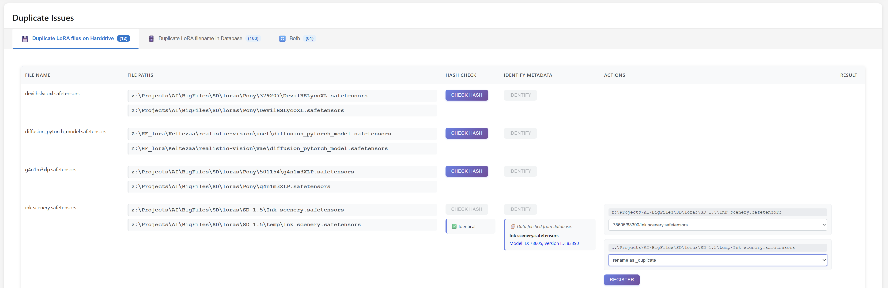

# App Features Screenshots

Below are screenshots demonstrating key features of the app:

---

**Summary**

---

**LoRA Hub**

---

**Duplicate LoRA Example 1**

---

**Duplicate LoRA Example 2**

---

**Orphan Files**

---

**Register LoRA**

---

**Register LoRA Error** [dont worry - Registration will continue]

---

**LoRA Detail**

