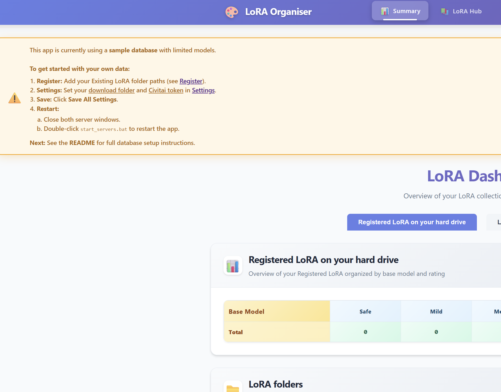

# 🎨 civit-lora-download

> Easily organize and download LoRA using a pre-scraped CivitAI database—all in one simple app.

  

## 📋 Table of Contents
- [✨ Features](#features)
- [🚀 How to begin after installation?](#how-to-begin)
- [⚙️ Installation](#installation)
  - [📋 Prerequisites](#prerequisites)
  - [🔧 Setup](#setup)
  - [🗄️ Database Setup](#database-setup)
- [🔧 Troubleshooting](#troubleshooting)
- [💝 Support & Donations](#support--donations)

## ✨ Features

Easily manage, download, and organize your LoRA models with these helpful tools:

| Feature | Documentation |
|---------|---------------|
| 🔍 **Scan & Register existing LoRA** | [Screenshots and Steps](docs/file-scanner.md) |
| ⬇️ **Download LoRA from Civitai with Filters** | [Screenshots and Steps](docs/download-management.md) |
| 🔍 **Detect Duplicates and Orphan LoRA** | [Screenshots and Steps](docs/duplicate-orphan-finder.md) |
| 👤 **LoRA Profile Page** | [Screenshots and Steps](docs/lora-details.md) |
| 📊 **Dashboard of Registered LoRA** | [Screenshots and Steps](docs/dashboard.md) |
| 🎯 **Fetch Trigger Words** | [Screenshots and Steps](docs/trigger-word-finder.md) |
| ⚙️ **Settings** | [Screenshots and Steps](docs/settings.md) |

## 🚀 How to begin after installation?

Follow these simple steps to get your LoRA collection up and running in the app:

**Register and Validate LoRA**

1. Tell the app where your LoRA folders are.
2. Click Scan to find your LoRA files.
3. Register your found LoRA.
4. Validate to check if files are working.

**Handle Duplicates and Orphans**

5. Remove any duplicates the app finds.
6. Fix any orphan files (files not linked to a model).

**LoRA Management**

7. Download new LoRA from CivitAI if you want.
8. Fetch trigger words to use with your LoRA.
9. Check the LoRA Hub to view downloaded, ignored, or failed LoRA.

## ⚙️ Installation (one-time activity)

### <u>Prerequisites</u>
- Install Node.js 20
- Windows 11 (Linux might not work)

### <u>App Setup</u>
1. Clone this app or download zip
2. Run `start_servers.bat` (first time takes a while)
3. Open http://localhost:5173/ in your browser
4. You should see the app interface like below

    

5. Configure these settings:
   - **Register**: Add your existing LoRA folder paths
   - **Settings**: Set download folder and Civitai token
   - **Save**: Click 'Save All Settings'
6. **Restart the app:**
   - Close both server windows.
   - Double-click `start_servers.bat` to restart the app.

### <u>Database Setup</u>

This database only contains LoRA data up to 7 May 2025.

1. Download and unzip the database file named `models_standalone.db` from [this link](https://drive.proton.me/urls/2ERE25EKZW#sXQbMZspNTUa).
2. On the Settings page, provide the file path to your `models_standalone.db` file.
3. Press the **Verify** button and make sure you see green checkmarks everywhere and no errors.
4. Press **Save DB path** (see screenshot below):

   

5. Restart the app again (close both server windows and double-click `start_servers.bat`).
6. Verify on the home page that warning is removed.

🎉 Congrats! Your app is now ready to use.

## 🔧 Troubleshooting

### Common Issues
- ⚠️ **App won't start**: Make sure Node.js is installed
- 🔌 **Can't connect**: Check if the server is running on the correct port
- ❌ **Download fails**: Verify your Civitai API token

## 💝 Support & Donations

If you find this project helpful, consider supporting it!

**MetaMask (ETH/BSC/Polygon):**

`0x2900e256ad4C5a6035ee90B975243C13c8e71049`
