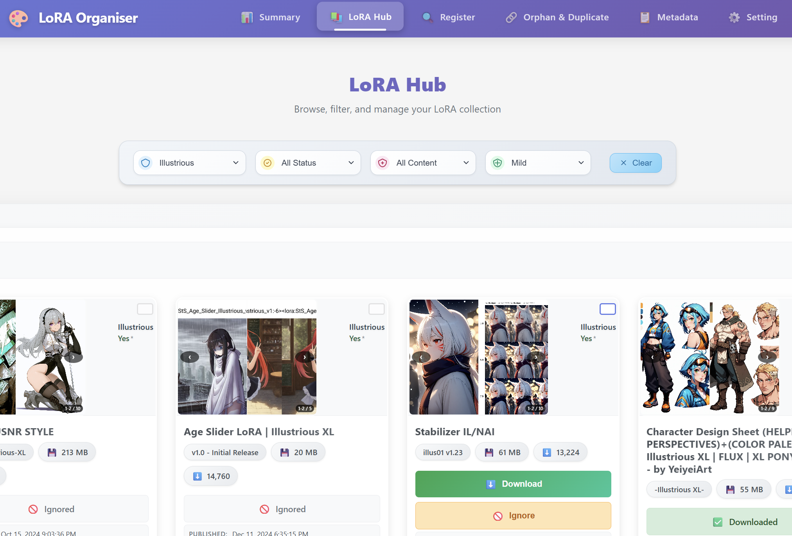

# 🎨 civit-lora-download

> Easily organize and download LoRA using a pre-scraped CivitAI database—all in one simple app.

  

## 📋 Table of Contents
- [✨ Features](#features)
- [🚀 How to begin after installation?](#how-to-begin)
- [⚙️ Installation](#installation)
  - [📋 Prerequisites](#prerequisites)
  - [🔧 Setup](#setup)
  - [🗄️ Database Setup](#database-setup)
- [🔧 Troubleshooting](#troubleshooting)
- [💝 Support & Donations](#support--donations)

## ✨ Features

| Feature | Documentation |
|---------|---------------|
| 🔍 **Scan & Register existing LoRA** | [Screenshots and Steps](docs/file-scanner.md) |
| ⬇️ **Download LoRA from Civitai with Filters** | [Screenshots and Steps](docs/download-management.md) |
| 🔍 **Detect Duplicates and Orphan LoRA** | [Screenshots and Steps](docs/duplicate-orphan-finder.md) |
| 👤 **LoRA Profile Page** | [Screenshots and Steps](docs/lora-details.md) |
| 📊 **Dashboard of Registered LoRA** | [Screenshots and Steps](docs/dashboard.md) |
| 🎯 **Fetch Trigger Words** | [Screenshots and Steps](docs/trigger-word-finder.md) |
| ⚙️ **Settings** | [Screenshots and Steps](docs/settings.md) |

## 🚀 How to begin after installation?

1. Share your LoRA folders path on harddrive
2. Press Scan Button
3. Register lora
4. Validate files
5. Fix duplicates
6. Fix Orphans
7. Download new LoRA
8. Fetch Metadata for trigger words

## ⚙️ Installation

### 📋 Prerequisites
- Install Node.js 20
- Windows 11 (Linux might not work)

### 🔧 App Setup
1. Clone this app or download zip
2. Run `start_servers.bat` (first time takes a while)
3. Open http://localhost:5173/ in your browser
4. You should see the app interface like below

  

5. Configure these settings:
   - **Register**: Add your existing LoRA folder paths
   - **Settings**: Set download folder and Civitai token
   - **Save**: Click 'Save All Settings'
6. Restart the app

### 🗄️ Database Setup
<!-- Add database setup instructions here -->

## 🔧 Troubleshooting

### Common Issues
- ⚠️ **App won't start**: Make sure Node.js is installed
- 🔌 **Can't connect**: Check if the server is running on the correct port
- ❌ **Download fails**: Verify your Civitai API token

## 💝 Support & Donations

If you find this project helpful, consider supporting it!

**MetaMask (ETH/BSC/Polygon):**

`0x2900e256ad4C5a6035ee90B975243C13c8e71049`
