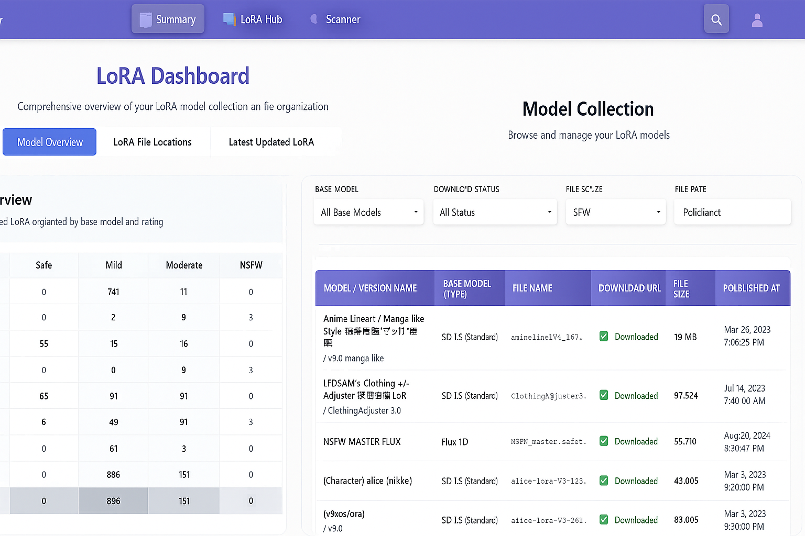
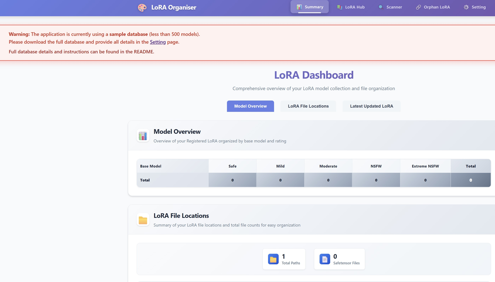
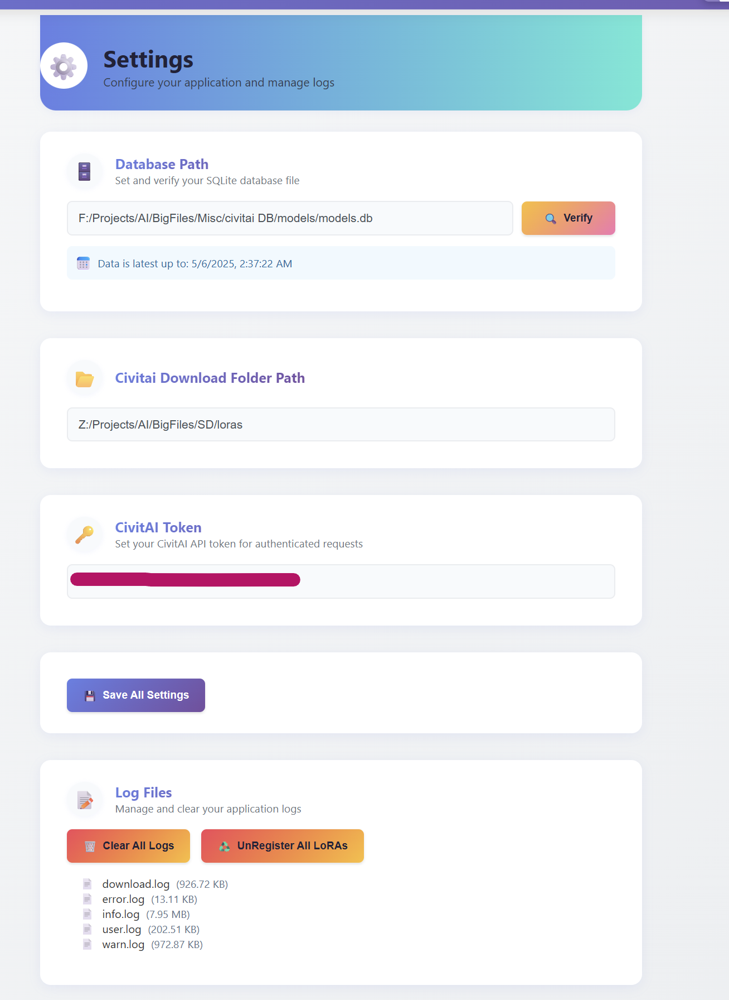

# civit-lora-download

Easily organize and download LoRA models using a pre-scraped CivitAI database—all in one simple app.



## Features ([screenshots](FEATURES.md))

- Effortlessly organize your LoRA models on your local hard drive
- Download LoRA models directly from Civitai
- Scan and register existing LoRA models already present on your hard drive
- Detect and list orphan files (files not linked to any model)
- Identify and manage duplicate LoRA models on your HDD

## Prerequisites
- Node.js v20 must be installed on your system. [Download Node.js here](https://nodejs.org/en/download)

## Setup

1. Clone this project:
   ```
   git clone https://github.com/rajeevbarde/civit-lora-download.git
   ```

2. Run `start_servers.bat` to launch both the frontend and backend servers at once. This will also automatically download and install all necessary files and dependencies.

3. Visit [http://localhost:5173/](http://localhost:5173/) in your browser. If the page doesn't load, check the console for the correct port number.

---

🎉 **Congratulations!** If you can see the app's homepage as shown below with warning, your basic setup is done.



## About the Warning Message

The warning appears because this app uses a sample of a community-scraped CivitAI database (Data till May 2025). The full collection is available via a Reddit post [here](https://www.reddit.com/r/StableDiffusion/comments/1kfvt73/civitai_model_database_checkpoints_and_loras/). This just lets you know you're viewing a limited dataset.

I used that database to create a new minimal version focused on LoRA models.

**To use the minimal LoRA database:**

1. Download the file from [this link](#) (link placeholder).
2. Save the downloaded file in a suitable folder where you can easily find and access it later.
3. Follow the next App configuration guide to complete the setup.

## App Configuration Guide

For author's App settings, see [AUTHORCONFIG.md](AUTHORCONFIG.md).

**It is strongly recommended that any folder path saved in the app should NOT be inside this project folder.**

### Database Path Location

1. Set the full file path to the database file you downloaded in the previous steps.
2. Press the **Verify** button to check the database file.
3. Press the **Save DB path** button to save your configuration.



### Download Directory and API Token

1. Save the full folder path where all the LoRA files will get downloaded.
2. Add your Civitai API token.
3. Press the **Save All settings** button to apply your changes.