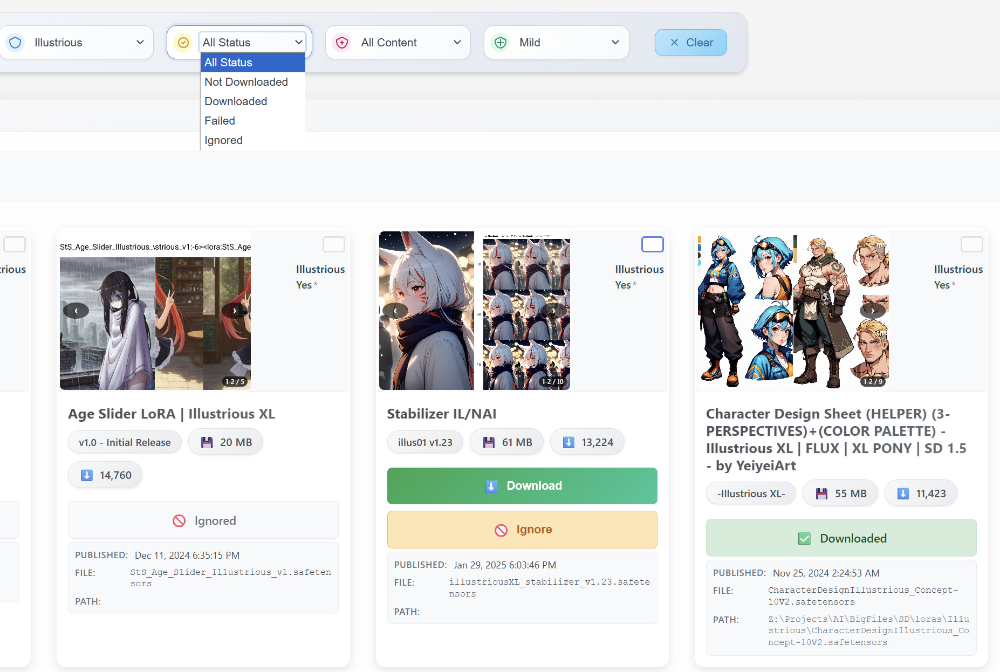

# 🎯 Civitai LoRA Downloader

> **Download and manage LoRA models from CivitAI with powerful filtering and organization tools**

**⚠️ Important Note**: The database contains data from May 7, 2025 only and may not reflect the latest models available on CivitAI.

---

## 📥 Download Filters Overview

The download management system provides several filter options to help you organize and manage your LoRA downloads effectively. Each filter serves a specific purpose in your workflow.

  

---

## 🔽 Download Filter

> **Add selected LoRA models to your download queue for immediate processing**

---

## ❌ Not Download Filter

> **Mark selected LoRA models as not wanted - they won't be downloaded**

---

## 🚫 Ignore Filter

> **Temporarily ignore selected models - they can be reconsidered later**

---

## 🔄 Retry Filter

> **Re-attempt download for previously failed or incomplete downloads**

---

> **💡 Pro Tip**: Use the ignore filter for models you're unsure about - you can always reconsider them later!
