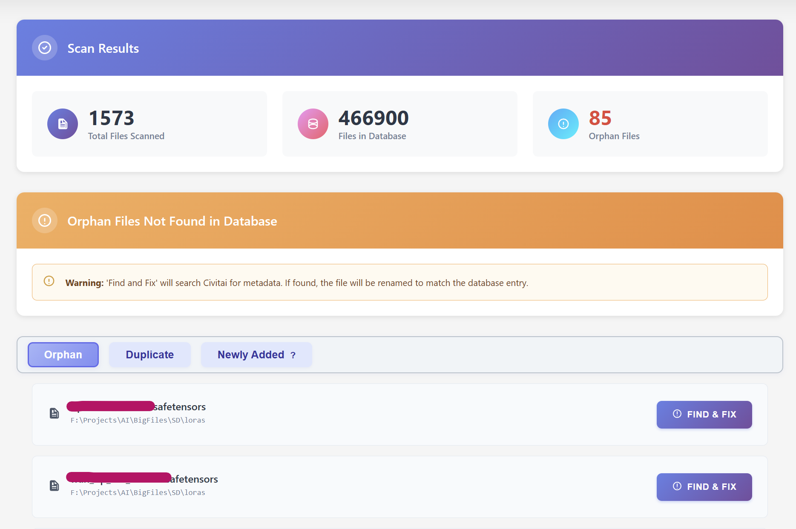

# 🔍 Duplicate & Orphan LoRA Finder

> **Detect and manage duplicate files and orphaned LoRA models in your collection**

This powerful tool helps you identify duplicate LoRA files using hash checking and manage orphaned files that are no longer registered in your database.

---

## 🔄 Duplicate Detection Process

The system uses **hash checking** to identify identical files, then fetches metadata from both the database and CivitAI API to provide comprehensive information about each duplicate.

> **⚠️ Important**: Files found in duplicates are **not registered** with the database. During registration, you'll be asked to rename one file with a `_duplicate` suffix to make it easy to find and delete later.

  

Under the orphan results, you'll find the duplicate files that have been renamed with the `_duplicate` suffix. These files are no longer registered in your database and can be safely reviewed for deletion.

  

---

## 📁 Orphan File Management

The **Find & Fix** feature will search for metadata from CivitAI, register the file, and rename it appropriately for proper management.

  

---

## 🔧 How It Works

### **Duplicate Detection**:
1. 🔍 **Hash Check** - Files are compared using cryptographic hashes
2. 📊 **Metadata Fetch** - Information retrieved from database and CivitAI API
3. 🏷️ **Registration Process** - One file gets `_duplicate` suffix
4. 📝 **Database Update** - Only the main file remains registered

### **Orphan Management**:
- 📁 **Renamed Files** - Duplicates with `_duplicate` suffix appear here
- 🗑️ **Safe Deletion** - These files can be reviewed and deleted
- 📊 **File Information** - Complete details about each orphaned file

> **💡 Pro Tip**: Always review orphaned files before deletion to ensure you're not removing important models!
