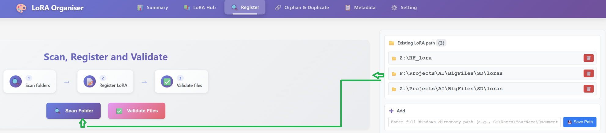
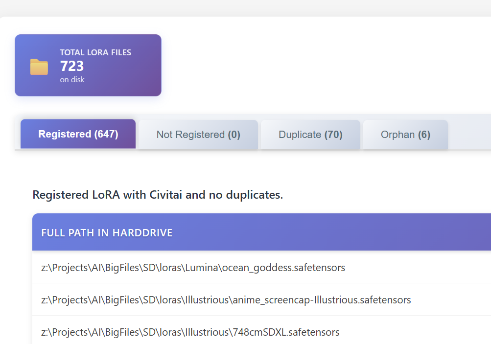
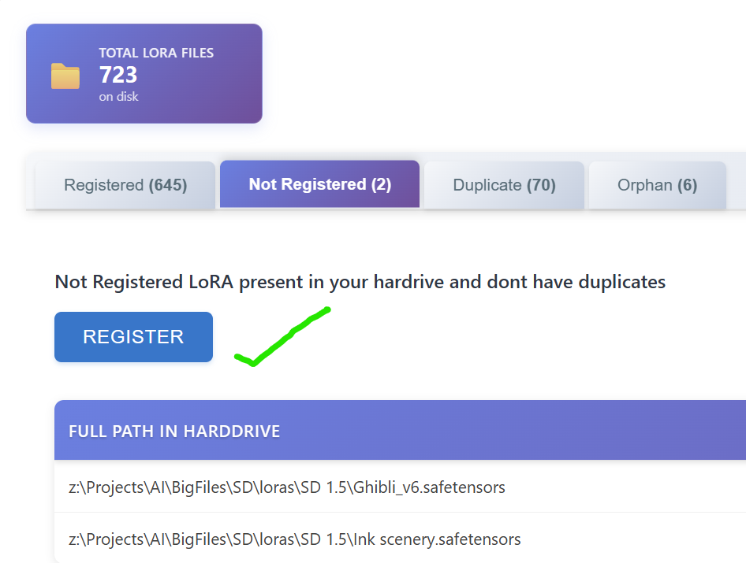
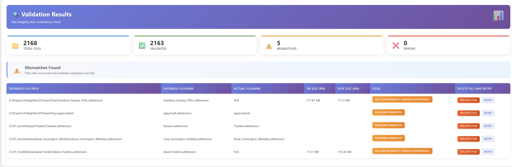
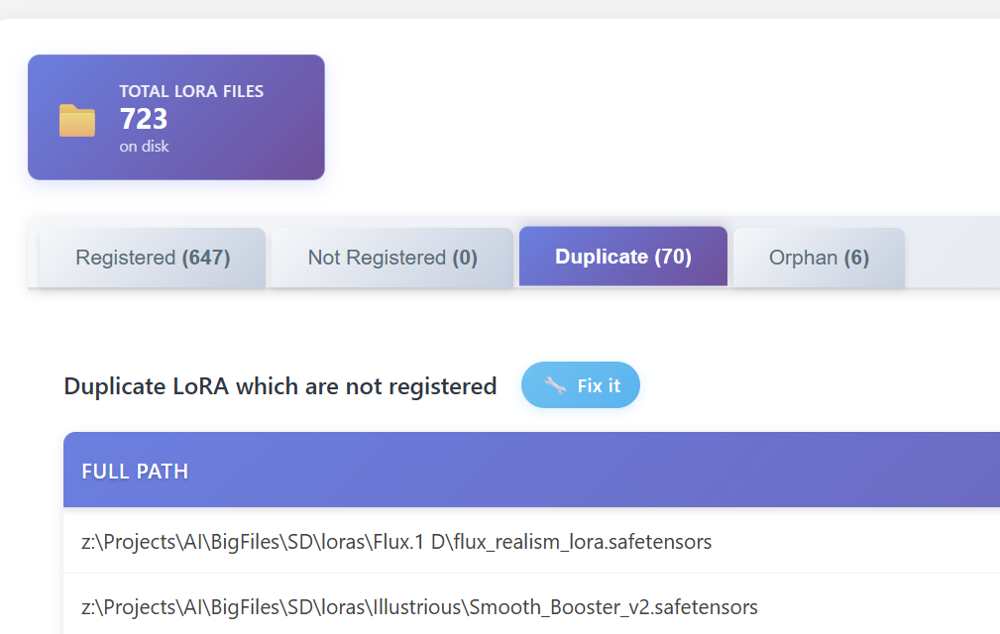

# 🔍 Scan & Register LoRA

> **Organize your LoRA collection with powerful scanning and registration tools**

This feature allows you to scan your local LoRA folders and register them in the database for better organization and management. Follow the step-by-step guide below to get started!

---

## 🚀 Step 1: Initiate Scan

> **Click the scan button to begin the process of discovering LoRA files in your specified folders.**

  

  

## 📊 Step 2: View Scan Results

> **After scanning, you'll see a comprehensive list of all discovered LoRA files with their details and status.**

  

## ✅ Step 3: Register LoRA Files

> **Select the LoRA files you want to register and add them to your database for tracking and management.**

  

## 🔍 Step 4: Validate Files

> **Validate the registered LoRA files to ensure they are properly formatted and contain the expected metadata.**

  

## 🔄 Step 5: Manage Duplicates

> **Review and handle duplicate LoRA files to maintain a clean and organized collection.**

  

---

## 🎉 What's Next?

After completing the scan and registration process, you can:

- 📥 **Download new LoRA** from CivitAI
- 🏷️ **Fetch metadata** for trigger words
- 📊 **View your collection** in the dashboard
- ⚙️ **Manage settings** and preferences

> **💡 Tip**: Regular scanning helps keep your LoRA collection organized and up-to-date!
