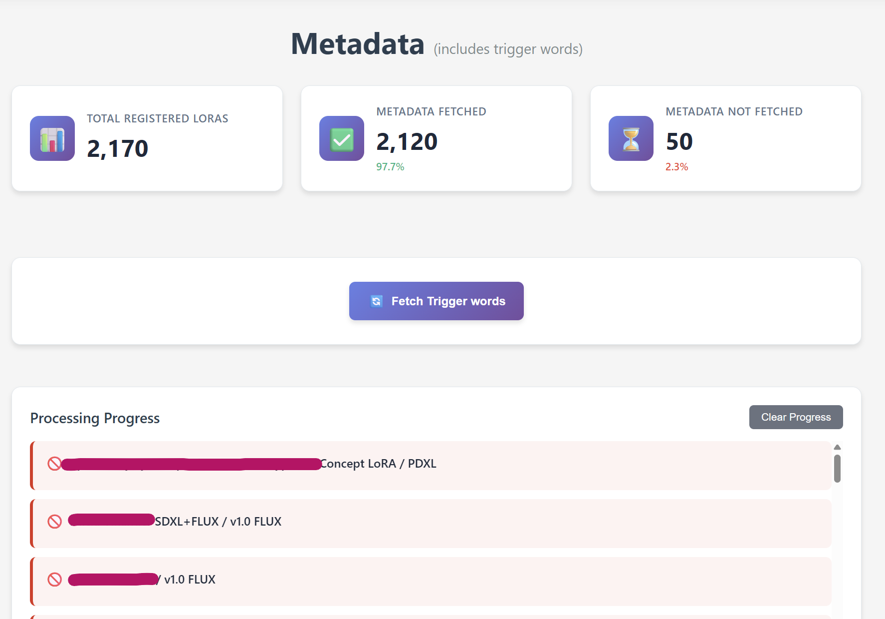

# 🏷️ Trigger Word Finder

> **Fetch and discover trigger words for your LoRA models from CivitAI metadata**

This feature fetches trigger words for LoRA models from CivitAI's metadata, which are then displayed on the LoRA details page to help you use the models effectively.

  

